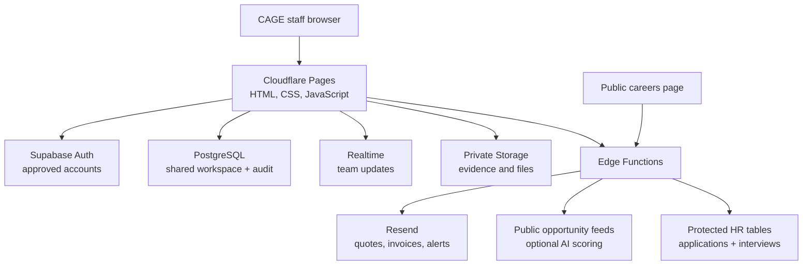

# Production architecture

## Data design

Version 9 uses one coherent JavaScript state object. The first production release stores it in one versioned PostgreSQL `jsonb` row per organization. Optimistic version checks prevent silent overwrites, Realtime distributes updates, and audit rows record who changed the workspace.

Files, email logs, account records, opportunity sources and opportunity matches use normalized tables because they require separate security and retention controls.

## Security boundaries

- The browser receives only the Supabase URL and public anon key.
- Row Level Security limits every record to the signed-in user's organization.
- Service-role, email and AI keys exist only as Edge Function secrets.
- Public sign-up is disabled; approved users must be invited.
- Alexander and Ndapile are administrators.
- The private `cage-files` bucket uses organization-prefixed paths.
- CVs, candidate applications, interview records and employee documents are stored separately from operational project data.
- Only administrators, managers and HR-role users may read recruitment records; employees may read their own employment records and documents.
- Security headers block framing, content sniffing and unnecessary device access.

## Current release boundary

The versioned JSON workspace is appropriate for the initial seven-person team. If concurrent use or record volume grows materially, each module should move into its own relational tables with record-level updates.

Internal shared calendar events are production-ready. Two-way Google Calendar sync is not included because it requires a CAGE-owned Google Cloud OAuth application. Quotes and invoices send as branded HTML email; attached PDF generation is a separate enhancement.
